数据质量管理模块软件需求规格说明书

目录
1. 前言
   1.1 目的
   1.2 背景
   1.3 术语定义
   1.4 参考资料
2. 需求概述
   2.1 建设目标
   2.2 业务范围
   2.3 关键业务流程
3. 功能需求
   3.1 功能架构
   3.2 功能清单
   3.3 角色管理
   3.4 数据源管理
   3.5 流程管理
   3.6 纳管系统管理
   3.7 工作台
   3.8 模型管理
   3.9 规则管理
   3.10 告警配置
   3.11 告警信息
   3.12 需求管理
   3.13 数据质量任务配置
   3.14 数据质量任务监控
   3.15 考核管理
   3.16 统计结果管理
4. 非功能需求
   4.1 性能需求
   4.2 安全需求
   4.3 可用性需求
   4.4 可维护性需求
5. 系统集成
   5.1 数据管控平台功能迁移
   5.2 系统界面改造
6. 附录
   6.1 数据字典
   6.2 错误代码表
   6.3 接口清单

1. 前言

1.1 目的
本文档旨在详细说明数据质量管理模块的升级需求。通过建设数据管控免疫系统，实现：

1. 数据质量实时监控
   - 实现数据实时检测与核对
   - 支持系统内及跨系统数据校验
   - 确保数据完整性和一致性

2. 问题管理闭环
   - 及时发现技术差错和业务差错
   - 实现问题快速分发和处理
   - 提供处理进度跟踪

3. 质量评估体系
   - 建立数据质量考核机制
   - 实现任务处理效率评估
   - 提供质量改进建议

适用读者：
- 数据管理部：了解系统功能及管理要求
- 信息科技部：了解技术实现需求
- 项目组：了解详细开发需求

1.2 背景
1. 现状说明
   - 监管数据免疫系统二期已上线运行
   - 已实现跨系统数据差异核对
   - 具备基础告警通知功能

2. 升级需求
   - 新增数据质量管理模块
   - 增强系统内数据校验能力
   - 完善任务管理和考核机制

3. 系统定位
   - 作为全行数据质量管理平台
   - 承接原数据管控平台相关功能
   - 统一数据质量管理标准

1.3 术语定义
| 术语/简称 | 全称 | 说明 |
|---------|------|-----|
| 数据质量管理 | Data Quality Management | 对数据完整性、准确性、一致性等特征的管理过程 |
| 校验规则 | Validation Rules | 用于验证数据质量的规则集合 |
| 数据调取 | Data Extraction | 根据校验规则从监管系统中提取相关数据的过程 |
| 任务管理 | Task Management | 数据质量问题的分发、跟踪和处理流程 |
| 考核机制 | Assessment System | 对数据质量管理相关人员的绩效评估体系 |
| 数据模型 | Data Model | 描述数据结构和关系的抽象模型 |
| 告警级别 | Alert Level | 数据质量问题的严重程度分类 |

1.4 参考资料
| 序号 | 文档名称 | 版本 | 说明 |
|-----|---------|------|-----|
| 1 | 数据质量管理模块升级优化需求 | V1.2 | 2025-02-07 |
| 2 | 第一次需求分析会议纪要 | V1.0 | 需求调研文档 |
| 3 | 第二次需求分析会议纪要 | V1.0 | 需求确认文档 |
| 4 | 数据管控平台功能说明书 | V2.0 | 原平台功能参考 |

2. 需求概述

2.1 建设目标

1. 数据质量管控
   1.1 实时监控能力
   - 支持多维度数据质量检测
   - 实现实时校验和定期校验
   - 提供自定义校验规则配置

   1.2 校验范围
   - 单系统数据完整性校验
   - 跨系统数据一致性校验
   - 业务规则合规性校验

   1.3 质量评估
   - 数据质量评分体系
   - 问题分类统计分析
   - 趋势监控和预警

2. 问题处理机制
   2.1 问题发现
   - 自动化问题检测
   - 多级别告警机制
   - 问题分类与定级

   2.2 任务管理
   - 智能任务分发
   - 处理过程跟踪
   - 结果验证确认

   2.3 流程管理
   - 标准化处理流程
   - 多角色协作机制
   - 处理时效监控

3. 考核评估体系
   3.1 考核指标
   - 数据质量达标率
   - 问题处理及时率
   - 处理质量满意度

   3.2 评估维度
   - 部门维度评估
   - 个人维度评估
   - 系统维度评估

   3.3 结果应用
   - 考核结果统计
   - 改进建议生成
   - 激励机制支持

2.2 业务范围

1. 新增功能模块（13个）
   1.1 系统管理类（3个）
   - 角色管理
   - 数据源管理
   - 流程管理

   1.2 业务管理类（1个）
   - 纳管系统管理

   1.3 数据质量类（4个）
   - 模型管理
   - 规则管理
   - 告警配置
   - 告警信息

   1.4 任务管理类（2个）
   - 数据质量任务配置
   - 数据质量任务监控

   1.5 考核评估类（3个）
   - 考核管理
   - 统计结果管理
   - 工作台

2. 功能优化改造
   2.1 数据管控平台功能迁移
   - EAST日报配置迁移
   - 金数日报配置迁移
   - 质量模型迁移
   - 质量报告迁移

   2.2 系统功能改造
   - 首页整合改造
   - 框架升级改造

2.3 关键业务流程

1. 数据质量管理主流程
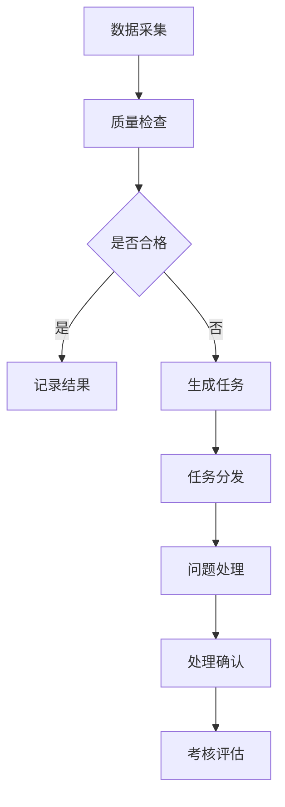

2. 任务管理流程
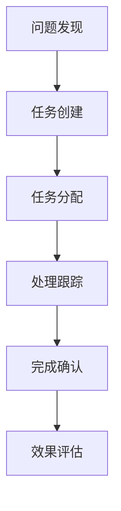

3. 考核评估流程
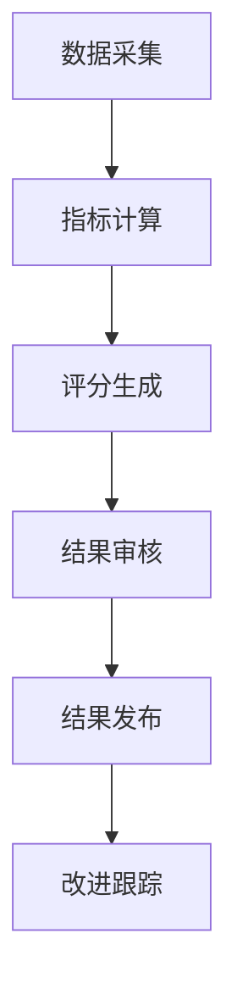

3. 功能需求

3.1 功能架构

1. 系统总体架构
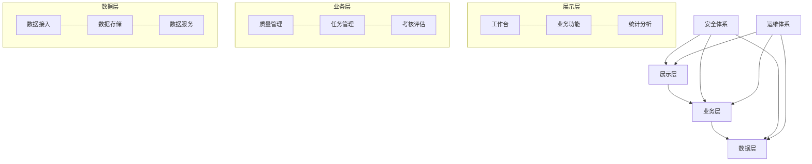

2. 功能模块分层
   2.1 基础管理层
   - 系统管理模块
   - 数据源管理模块
   - 流程管理模块

   2.2 数据质量层
   - 模型管理模块
   - 规则管理模块
   - 校验执行模块

   2.3 任务管理层
   - 需求管理模块
   - 任务配置模块
   - 任务监控模块

   2.4 考核评估层
   - 考核管理模块
   - 统计分析模块
   - 报告生成模块

3.2 功能清单

| 模块分类 | 功能编号 | 功能名称 | 功能描述 | 优先级 | 复杂度 | 依赖关系 |
|---------|---------|---------|----------|--------|--------|----------|
| 系统管理 | SYSTEM_01 | 角色管理 | 维护系统角色及权限 | 高 | 中 | 无 |
| 系统管理 | SYSTEM_02 | 数据源管理 | 管理系统数据源 | 高 | 中 | 无 |
| 系统管理 | SYSTEM_03 | 流程管理 | 配置业务流程 | 中 | 高 | SYSTEM_01 |
| 业务管理 | BUSINESS_01 | 纳管系统管理 | 管理纳管系统信息 | 高 | 中 | SYSTEM_02 |
| 数据质量 | MODEL_CONFIG_01 | 模型管理 | 管理数据模型 | 高 | 高 | BUSINESS_01 |
| 数据质量 | RULE_MANAGER_01 | 规则管理 | 管理校验规则 | 高 | 高 | MODEL_CONFIG_01 |
| 告警管理 | ALARM_MANAGER_01 | 告警配置 | 配置告警规则 | 中 | 中 | RULE_MANAGER_01 |
| 告警管理 | ALARM_MANAGER_02 | 告警信息 | 查看告警信息 | 中 | 低 | ALARM_MANAGER_01 |
| 任务管理 | DEMAND_MANAGER_01 | 需求管理 | 管理数据质量需求 | 高 | 中 | SYSTEM_01 |
| 任务管理 | JOB_MANAGER_01 | 任务配置 | 配置质量检查任务 | 高 | 高 | DEMAND_MANAGER_01 |
| 任务管理 | JOB_MANAGER_02 | 任务监控 | 监控任务执行情况 | 高 | 中 | JOB_MANAGER_01 |
| 考核管理 | ASSESSMENT_01 | 考核管理 | 管理考核指标 | 中 | 高 | JOB_MANAGER_02 |
| 统计分析 | STATISTICS_01 | 统计结果管理 | 管理统计分析结果 | 中 | 中 | ASSESSMENT_01 |
| 工作台 | TO_LIST_01 | 工作台 | 展示待办及统计信息 | 高 | 中 | 所有模块 |

3.3 角色管理（SYSTEM_01）

3.3.1 功能概述
- 功能目标：实现系统角色的全生命周期管理，支持灵活的权限分配机制
- 功能范围：角色创建、权限配置、角色分配、权限管理

3.3.2 功能架构
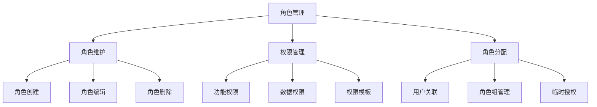

3.3.3 功能界面

1. 角色列表界面
   | 字段名称 | 字段类型 | 是否必填 | 校验规则 | 说明 |
   |---------|---------|---------|----------|-----|
   | 角色编码 | 字符串 | 是 | 唯一性校验 | 系统内唯一标识 |
   | 角色名称 | 字符串 | 是 | 长度≤50 | 角色显示名称 |
   | 所属系统 | 下拉选择 | 是 | - | 关联系统 |
   | 角色描述 | 文本域 | 否 | 长度≤200 | 角色用途说明 |
   | 创建时间 | 日期时间 | 是 | - | 自动生成 |
   | 状态 | 枚举 | 是 | - | 启用/禁用 |

2. 权限配置界面
   - 树形结构展示功能权限
   - 支持批量权限设置
   - 提供权限预览功能
   - 显示权限继承关系

3.3.4 业务规则

1. 角色管理规则
   - 角色编码全局唯一
   - 角色名称同系统内唯一
   - 内置角色不可删除
   - 已分配用户的角色不可直接删除

2. 权限配置规则
   - 支持功能权限和数据权限组合
   - 权限可继承可覆盖
   - 权限变更需要审批
   - 保留权限变更历史

3. 角色分配规则
   - 用户可以拥有多个角色
   - 角色可以设置有效期
   - 支持临时授权机制
   - 角色变更需要审批
   
3.4 数据源管理（SYSTEM_02）

3.4.1 功能概述
- 功能目标：提供统一的数据源配置和管理能力，确保数据访问的安全性和可靠性
- 功能范围：数据源配置、连接管理、监控告警、安全控制

3.4.2 功能架构
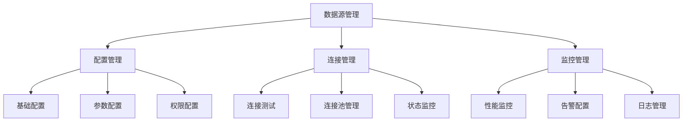

3.4.3 功能界面

1. 数据源列表
   | 字段名称 | 字段类型 | 是否必填 | 校验规则 | 说明 |
   |---------|---------|---------|----------|-----|
   | 数据源编码 | 字符串 | 是 | 唯一性校验 | 系统内唯一标识 |
   | 数据源名称 | 字符串 | 是 | 长度≤50 | 显示名称 |
   | 数据源类型 | 枚举 | 是 | - | MySQL/Oracle等 |
   | 连接地址 | 字符串 | 是 | URL格式 | 访问地址 |
   | 用户名 | 字符串 | 是 | - | 访问账号 |
   | 密码 | 字符串 | 是 | - | 加密存储 |
   | 状态 | 枚举 | 是 | - | 运行/停止/异常 |

2. 监控界面
   - 连接状态实时展示
   - 性能指标趋势图
   - 告警信息列表
   - 操作日志查询

3.4.4 业务规则

1. 配置管理规则
   - 数据源编码全局唯一
   - 密码必须加密存储
   - 支持多环境配置
   - 变更需要审批

2. 连接管理规则
   - 定期进行连接测试
   - 支持连接池管理
   - 异常自动重连
   - 维护连接日志

3. 监控管理规则
   - 实时监控连接状态
   - 定期采集性能指标
   - 超阈值自动告警
   - 保留历史记录

3.5 流程管理（SYSTEM_03）

3.5.1 功能概述
- 功能目标：实现系统业务流程的配置和管理，支持灵活的流程定制
- 功能范围：流程设计、流程部署、流程监控、流程优化

3.5.2 功能架构
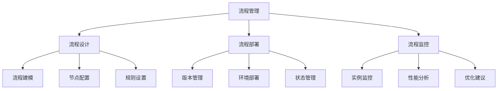

3.5.3 功能界面

1. 流程设计界面
   - 可视化流程设计器
   - 节点属性配置
   - 流程变量管理
   - 规则条件设置

2. 流程管理列表
   | 字段名称 | 字段类型 | 是否必填 | 校验规则 | 说明 |
   |---------|---------|---------|----------|-----|
   | 流程编码 | 字符串 | 是 | 唯一性校验 | 系统内唯一标识 |
   | 流程名称 | 字符串 | 是 | 长度≤50 | 显示名称 |
   | 流程分类 | 枚举 | 是 | - | 业务分类 |
   | 版本号 | 字符串 | 是 | - | 版本控制 |
   | 状态 | 枚举 | 是 | - | 设计/部署/运行 |

3.5.4 业务规则

1. 流程设计规则
   - 支持流程模板
   - 节点类型可扩展
   - 支持条件分支
   - 支持并行处理

2. 流程部署规则
   - 版本控制管理
   - 支持多环境部署
   - 支持回滚操作
   - 部署前自动验证

3. 流程监控规则
   - 实时状态监控
   - 性能指标采集
   - 异常自动告警
   - 支持手动干预

3.6 纳管系统管理（BUSINESS_01）

3.6.1 功能概述
- 功能目标：实现对纳入管理的业务系统的统一管理和监控
- 功能范围：系统注册、配置管理、监控管理、统计分析

3.6.2 功能架构
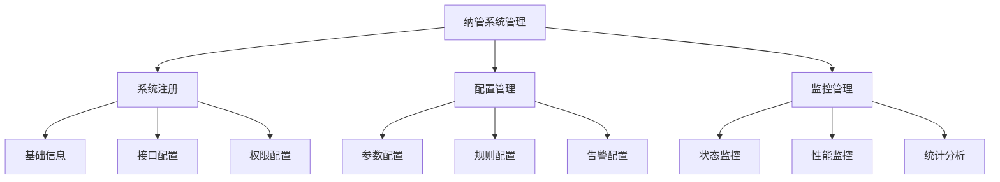
```

3.6.3 功能界面

1. 纳管系统列表
   | 字段名称 | 字段类型 | 是否必填 | 校验规则 | 说明 |
   |---------|---------|---------|----------|-----|
   | 系统编码 | 字符串 | 是 | 唯一性校验 | 系统标识 |
   | 系统名称 | 字符串 | 是 | 长度≤50 | 显示名称 |
   | 系统类型 | 枚举 | 是 | - | 业务分类 |
   | 负责人 | 字符串 | 是 | - | 系统负责人 |
   | 接入时间 | 日期时间 | 是 | - | 纳管时间 |
   | 状态 | 枚举 | 是 | - | 运行/停止/维护 |

2. 监控面板
   - 系统运行状态
   - 数据质量指标
   - 告警信息统计
   - 任务处理情况

3.7 工作台（TO_LIST_01）

3.7.1 功能概述
- 功能目标：提供统一的工作入口，展示个性化的工作内容和统计信息
- 功能范围：待办任务、统计分析、快捷操作、消息通知

3.7.2 功能架构
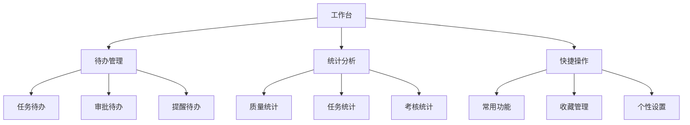

3.7.3 功能界面

1. 待办任务区
   | 字段名称 | 字段类型 | 显示规则 | 说明 |
   |---------|---------|----------|-----|
   | 任务类型 | 枚举 | 图标+文本 | 任务分类 |
   | 任务标题 | 字符串 | 链接 | 可点击跳转 |
   | 优先级 | 枚举 | 标签 | 重要程度 |
   | 截止时间 | 日期时间 | 倒计时 | 剩余时间 |
   | 状态 | 枚举 | 状态标签 | 处理状态 |

2. 统计分析区
   - 数据质量趋势图
   - 任务完成情况
   - 考核得分统计
   - 系统运行状态

3.7.4 业务规则

1. 待办展示规则
   - 按优先级排序
   - 超时任务突出显示
   - 支持批量处理
   - 自动刷新机制

2. 统计分析规则
   - 实时数据更新
   - 支持多维分析
   - 图表联动展示
   - 数据钻取功能

3.8 模型管理（MODEL_CONFIG_01）

3.8.1 功能概述
- 功能目标：实现数据模型的全生命周期管理，支持模型的设计、部署和监控
- 功能范围：模型设计、版本管理、部署管理、监控分析

3.8.2 功能架构
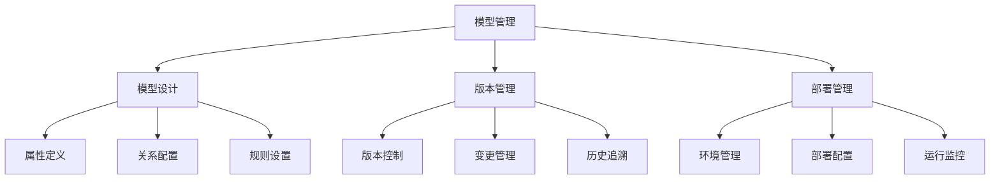

3.8.3 功能界面

1. 模型列表
   | 字段名称 | 字段类型 | 是否必填 | 校验规则 | 说明 |
   |---------|---------|---------|----------|-----|
   | 模型编码 | 字符串 | 是 | 唯一性校验 | 模型标识 |
   | 模型名称 | 字符串 | 是 | 长度≤50 | 显示名称 |
   | 模型分类 | 枚举 | 是 | - | 业务分类 |
   | 版本号 | 字符串 | 是 | - | 版本信息 |
   | 创建人 | 字符串 | 是 | - | 创建者 |
   | 状态 | 枚举 | 是 | - | 设计/部署/运行 |

2. 模型设计器
   - 可视化建模工具
   - 属性配置面板
   - 关系图谱展示
   - 规则配置界面
   
3.9 规则管理（RULE_MANAGER_01）

3.9.1 功能概述
- 功能目标：实现数据质量规则的统一管理，支持规则的定义、执行和监控
- 功能范围：规则定义、规则分类、规则执行、规则监控

3.9.2 功能架构
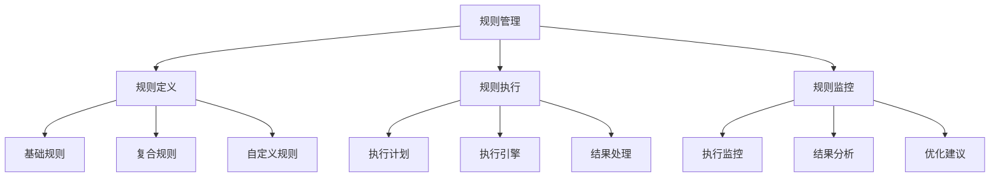

3.9.3 功能界面

1. 规则列表
   | 字段名称 | 字段类型 | 是否必填 | 校验规则 | 说明 |
   |---------|---------|---------|----------|-----|
   | 规则编码 | 字符串 | 是 | 唯一性校验 | 规则标识 |
   | 规则名称 | 字符串 | 是 | 长度≤50 | 显示名称 |
   | 规则类型 | 枚举 | 是 | - | 规则分类 |
   | 所属模型 | 字符串 | 是 | - | 关联模型 |
   | 优先级 | 枚举 | 是 | - | 执行优先级 |
   | 状态 | 枚举 | 是 | - | 启用/禁用 |

2. 规则配置界面
   - 规则参数配置
   - 执行条件设置
   - 告警阈值设置
   - 处理策略配置

3.9.4 业务规则

1. 规则定义规则
   - 支持多种规则类型
   - 规则可复用
   - 支持规则模板
   - 支持规则导入导出

2. 规则执行规则
   - 支持定时执行
   - 支持手动触发
   - 支持批量执行
   - 执行结果可追溯

3.10 告警配置（ALARM_MANAGER_01）

3.10.1 功能概述
- 功能目标：实现灵活的告警机制，支持多维度、多级别的告警配置
- 功能范围：告警规则、告警方式、告警级别、告警处理

3.10.2 功能架构
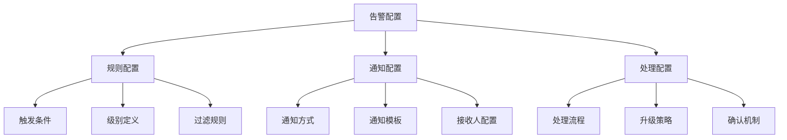

3.10.3 功能界面

1. 告警规则列表
   | 字段名称 | 字段类型 | 是否必填 | 校验规则 | 说明 |
   |---------|---------|---------|----------|-----|
   | 规则编码 | 字符串 | 是 | 唯一性校验 | 规则标识 |
   | 规则名称 | 字符串 | 是 | 长度≤50 | 显示名称 |
   | 告警级别 | 枚举 | 是 | - | 重要程度 |
   | 触发条件 | 字符串 | 是 | - | 触发表达式 |
   | 通知方式 | 多选 | 是 | - | 邮件/短信/系统消息 |
   | 状态 | 枚举 | 是 | - | 启用/禁用 |

2. 告警配置界面
   - 条件配置区
   - 通知设置区
   - 处理流程配置
   - 升级策略设置

3.10.4 业务规则

1. 告警规则配置
   - 支持多条件组合
   - 支持阈值设置
   - 支持时间窗口
   - 支持例外规则

2. 通知规则配置
   - 支持多渠道通知
   - 支持通知模板
   - 支持定时发送
   - 支持重复过滤

3. 处理规则配置
   - 支持自动处理
   - 支持手动确认
   - 支持升级策略
   - 支持关联分析
   
3.11 告警信息（ALARM_MANAGER_02）

3.11.1 功能概述
- 功能目标：提供告警信息的统一展示和处理平台，支持告警的全生命周期管理
- 功能范围：告警展示、告警处理、告警分析、告警统计

3.11.2 功能架构
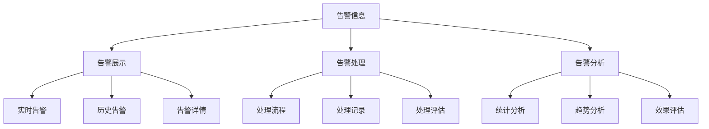

3.11.3 功能界面

1. 告警列表
   | 字段名称 | 字段类型 | 显示规则 | 说明 |
   |---------|---------|----------|-----|
   | 告警ID | 字符串 | - | 唯一标识 |
   | 告警标题 | 字符串 | 突出显示 | 告警概述 |
   | 告警级别 | 枚举 | 颜色标识 | 重要程度 |
   | 告警时间 | 日期时间 | - | 发生时间 |
   | 告警来源 | 字符串 | - | 触发系统 |
   | 处理状态 | 枚举 | 状态标识 | 处理进度 |

2. 告警详情界面
   - 基本信息区
   - 详细信息区
   - 处理记录区
   - 相关告警区

3.11.4 业务规则

1. 告警展示规则
   - 按优先级排序
   - 支持多维过滤
   - 支持实时刷新
   - 支持批量处理

2. 告警处理规则
   - 处理流程可配置
   - 支持处理委派
   - 支持批注记录
   - 支持关联处理

3.12 需求管理（DEMAND_MANAGER_01）

3.12.1 功能概述
- 功能目标：实现数据质量需求的全流程管理，支持需求的收集、评估和跟踪
- 功能范围：需求收集、需求评估、需求分配、需求跟踪

3.12.2 功能架构
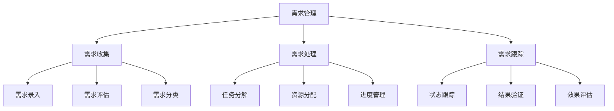

3.12.3 功能界面

1. 需求列表
   | 字段名称 | 字段类型 | 是否必填 | 校验规则 | 说明 |
   |---------|---------|---------|----------|-----|
   | 需求编号 | 字符串 | 是 | 自动生成 | 唯一标识 |
   | 需求标题 | 字符串 | 是 | 长度≤100 | 需求概述 |
   | 需求类型 | 枚举 | 是 | - | 需求分类 |
   | 优先级 | 枚举 | 是 | - | 重要程度 |
   | 提交人 | 字符串 | 是 | - | 需求提出人 |
   | 提交时间 | 日期时间 | 是 | - | 提交时间 |
   | 状态 | 枚举 | 是 | - | 处理状态 |

2. 需求处理界面
   - 基本信息区
   - 详细描述区
   - 附件管理区
   - 处理记录区

3.12.4 业务规则

1. 需求提交规则
   - 必填信息完整
   - 支持附件上传
   - 自动通知相关人
   - 支持紧急标记

2. 需求处理规则
   - 支持多人协作
   - 支持任务分解
   - 支持进度更新
   - 支持结果确认
   
3.13 数据质量任务配置（JOB_MANAGER_01）

3.13.1 功能概述
- 功能目标：实现数据质量检查任务的配置管理，支持灵活的任务定制和调度
- 功能范围：任务配置、调度管理、执行管理、结果管理

3.13.2 功能架构
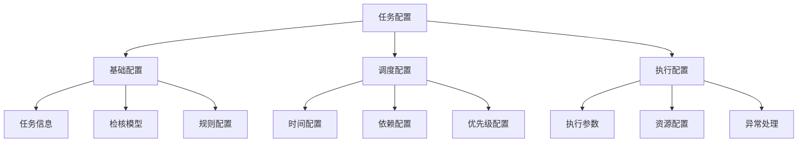

3.13.3 功能界面

1. 任务配置列表
   | 字段名称 | 字段类型 | 是否必填 | 校验规则 | 说明 |
   |---------|---------|---------|----------|-----|
   | 任务编码 | 字符串 | 是 | 唯一性校验 | 任务标识 |
   | 任务名称 | 字符串 | 是 | 长度≤50 | 显示名称 |
   | 任务类型 | 枚举 | 是 | - | 系统任务/临时任务 |
   | 关联需求 | 字符串 | 否 | - | 关联需求编号 |
   | 执行频率 | 枚举 | 是 | - | 执行周期 |
   | 状态 | 枚举 | 是 | - | 启用/禁用 |

2. 任务配置界面
   - 基本信息配置
   - 检核规则配置
   - 调度参数配置
   - 处理人员配置

3.13.4 业务规则

1. 配置管理规则
   - 任务编码唯一
   - 支持模板配置
   - 支持规则复用
   - 支持批量操作

2. 调度管理规则
   - 支持多种调度方式
   - 支持依赖关系
   - 支持优先级设置
   - 支持临时调整

3.14 数据质量任务监控（JOB_MANAGER_02）

3.14.1 功能概述
- 功能目标：提供任务执行的实时监控和管理能力，支持问题快速发现和处理
- 功能范围：执行监控、状态管理、异常处理、性能分析

3.14.2 功能架构
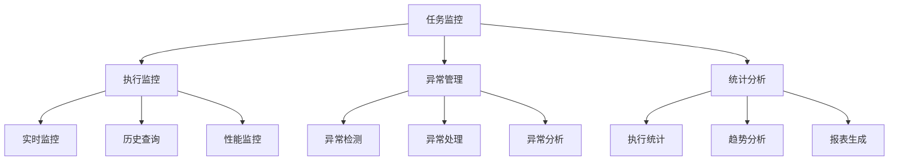

3.14.3 功能界面

1. 任务监控列表
   | 字段名称 | 字段类型 | 显示规则 | 说明 |
   |---------|---------|----------|-----|
   | 任务ID | 字符串 | - | 执行实例ID |
   | 任务名称 | 字符串 | - | 任务名称 |
   | 开始时间 | 日期时间 | - | 执行开始时间 |
   | 结束时间 | 日期时间 | - | 执行结束时间 |
   | 执行进度 | 进度条 | 百分比 | 当前进度 |
   | 执行状态 | 枚举 | 状态标识 | 运行状态 |
   | 异常信息 | 字符串 | 错误提示 | 异常描述 |

2. 监控详情界面
   - 基本信息区
   - 执行详情区
   - 日志信息区
   - 性能指标区

3.14.4 业务规则

1. 监控管理规则
   - 实时状态更新
   - 支持手动干预
   - 异常自动告警
   - 历史记录保留

2. 异常处理规则
   - 支持重试机制
   - 支持手动恢复
   - 支持任务终止
   - 支持问题追溯
   
3.15 考核管理（ASSESSMENT_01）

3.15.1 功能概述
- 功能目标：实现数据质量相关人员的考核评估管理，支持客观的绩效考核
- 功能范围：指标配置、考核计算、结果管理、考核分析

3.15.2 功能架构
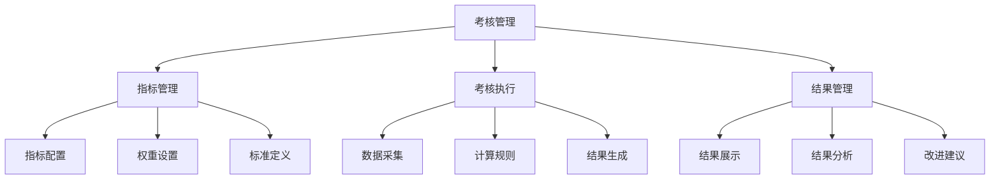

3.15.2 功能界面

1. 考核指标配置
   | 字段名称 | 字段类型 | 是否必填 | 校验规则 | 说明 |
   |---------|---------|---------|----------|-----|
   | 指标编码 | 字符串 | 是 | 唯一性校验 | 指标标识 |
   | 指标名称 | 字符串 | 是 | 长度≤50 | 显示名称 |
   | 指标类型 | 枚举 | 是 | - | 指标分类 |
   | 计算公式 | 字符串 | 是 | - | 计算规则 |
   | 指标权重 | 数值 | 是 | 0-100 | 权重系数 |
   | 考核周期 | 枚举 | 是 | - | 日/周/月/季/年 |

2. 考核结果列表
   | 字段名称 | 字段类型 | 显示规则 | 说明 |
   |---------|---------|----------|-----|
   | 考核对象 | 字符串 | - | 被考核人 |
   | 考核周期 | 字符串 | - | 考核时间段 |
   | 总分 | 数值 | 突出显示 | 考核得分 |
   | 指标得分 | 数值 | - | 分项得分 |
   | 评级 | 枚举 | 等级标识 | 考核等级 |
   | 状态 | 枚举 | - | 处理状态 |

3.15.3 业务规则

1. 指标配置规则
   - 指标体系完整性
   - 权重合理性校验
   - 支持指标版本
   - 支持指标继承

2. 考核计算规则
   - 自动数据采集
   - 多维度计算
   - 支持手工调整
   - 结果审核机制

3. 结果管理规则
   - 定期结果生成
   - 支持结果确认
   - 申诉处理机制
   - 历史记录保留

3.16 统计结果管理（STATISTICS_01）

3.16.1 功能概述
- 功能目标：提供全面的统计分析功能，支持多维度的数据质量分析和决策支持
- 功能范围：数据采集、统计分析、报表生成、趋势预测

3.16.2 功能架构
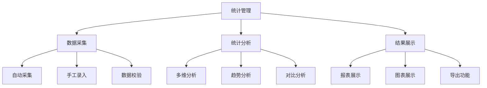

3.16.3 功能界面

1. 统计分析界面
   - 条件筛选区
   - 统计图表区
   - 明细数据区
   - 操作工具栏

2. 报表配置
   | 字段名称 | 字段类型 | 是否必填 | 校验规则 | 说明 |
   |---------|---------|---------|----------|-----|
   | 报表编码 | 字符串 | 是 | 唯一性校验 | 报表标识 |
   | 报表名称 | 字符串 | 是 | 长度≤50 | 显示名称 |
   | 报表类型 | 枚举 | 是 | - | 报表分类 |
   | 统计周期 | 枚举 | 是 | - | 统计频率 |
   | 展示方式 | 多选 | 是 | - | 图表类型 |
   | 状态 | 枚举 | 是 | - | 启用/禁用 |

3.16.4 业务规则

1. 数据采集规则
   - 支持多源采集
   - 实时/定时采集
   - 数据校验机制
   - 异常数据处理

2. 统计分析规则
   - 多维度分析
   - 支持钻取分析
   - 支持对比分析
   - 支持预警分析

3. 报表管理规则
   - 模板化管理
   - 支持定制化
   - 支持订阅推送
   - 权限控制机制
